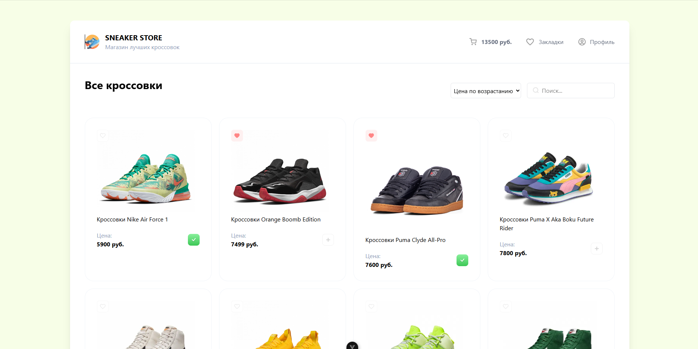

# 🏃‍♂️ Vue Sneaker Store

[](https://vuejs.org/)
[](https://vitejs.dev/)
[](https://tailwindcss.com/)
[](./LICENSE)

---

## 📌 О проекте

**Vue Sneaker Store** — это SPA-приложение интернет-магазина кроссовок, созданное с нуля на **Vue 3 + Vite** с использованием **Tailwind CSS** и интеграцией через **REST API**.  
Проект демонстрирует навыки компонентной архитектуры, работы с props/emits, адаптивной верстки и взаимодействия с сервером.

---

## 🖼️ Скриншоты / демо



| Страница | Описание |
|-----------|-----------|
| 🏠 Главная / каталог | Отображение списка кроссовок, фильтрация |
| 👟 Страница товара | Подробная информация и добавление в корзину |
| 🛒 Корзина | Просмотр выбранных товаров и оформление заказа |

---

## 🚀 Установка и запуск

1. **Клонировать репозиторий**
   ```bash
   git clone https://github.com/vladislav120114/Vue-Project.git
   cd Vue-Project
   ```

2. **Установить зависимости**
   ```bash
   npm install
   ```

3. **Запустить проект**
   ```bash
   npm run dev
   ```

4. **Сборка для продакшена**
   ```bash
   npm run build
   ```

5. **Линтинг кода**
   ```bash
   npm run lint
   ```

---

## 🧰 Технологии / стек

- ⚙️ **Vue 3** + Composition API  
- ⚡ **Vite** — быстрая сборка и hot-reload  
- 🎨 **Tailwind CSS** — стилизация и адаптив  
- 🔗 **REST API** (fetch / axios)  
- 🧠 **JavaScript (ES6+)**  
- 🔄 **Git / GitHub** — контроль версий  

---

## 🔍 Функциональность

- Просмотр и фильтрация списка кроссовок  
- Страница с деталями товара  
- Корзина (добавление, удаление, оформление)  
- Получение и отправка данных через REST API  
- Полностью адаптивная верстка под разные устройства  

---

## 🛠️ Возможности для улучшения (TODO)

- 🔑 Авторизация (регистрация / логин)  
- 👤 Личный кабинет пользователя  
- 🔔 Toaster-уведомления  
- 🧩 Управление состоянием через **Pinia / Vuex**  
- 💳 Интеграция с платежной системой  
- ✨ Улучшения UI и анимаций  

---

## 📂 Структура проекта

```
Vue-Project/
├── public/
├── src/
│   ├── assets/
│   ├── components/
│   ├── pages/
│   ├── router/
│   ├── services/        # Работа с API
│   └── main.js
├── package.json
├── vite.config.js
└── README.md
```

---

## 🧠 Автор проекта

**Владислав [Фамилия]**  
📍 Архангельск, Россия  
🌐 GitHub: [vladislav120114](https://github.com/vladislav120114)  
✉️ Email: vlad.yaksin@yandex.ru  
💬 Telegram: @lupen813

---

## 📝 Лицензия

Этот проект распространяется под лицензией **MIT**.  
Вы можете использовать и изменять его в образовательных целях.

---

⭐️ Если проект понравился — поставь звёздочку на GitHub!
